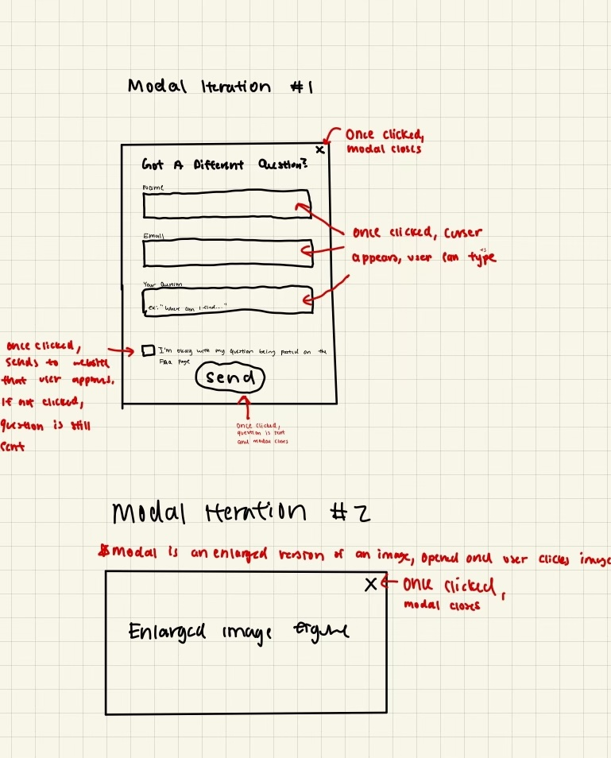
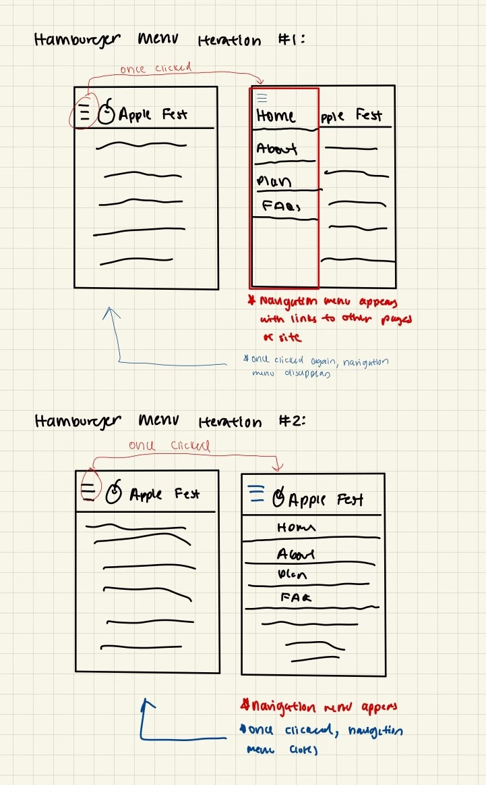
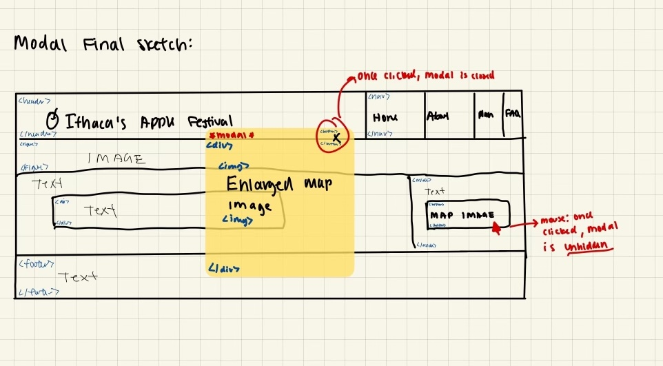
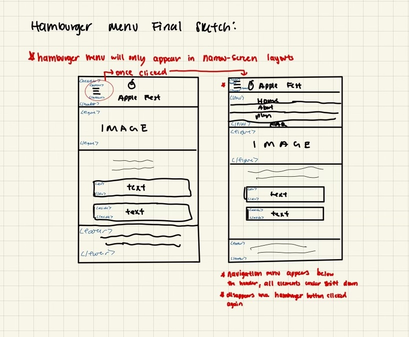
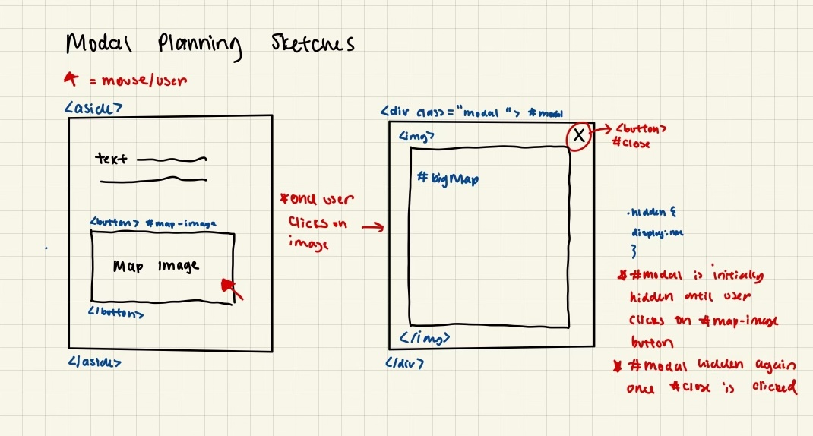
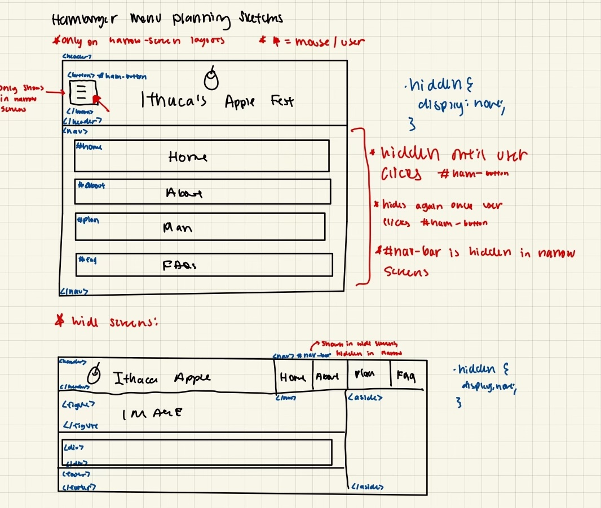

# Project 3: Design Journey

**For each milestone, complete only the sections that are labeled with that milestone.** Refine all sections before the final submission.

You are graded on your design process. If you later need to update your plan, **do not delete the original plan, leave it in place and append your new plan _below_ the original.** Then explain why you are changing your plan. Any time you update your plan, you're documenting your design process!

**Replace ALL _TODOs_ with your work.** (There should be no TODOs in the final submission.)

Be clear and concise in your writing. Bullets points are encouraged.

Place all design journey images inside the "design-plan" folder and then link them in Markdown so that they are visible in Markdown Preview.

**Everything, including images, must be visible in _Markdown: Open Preview_.** If it's not visible in the Markdown preview, then we can't grade it. We also can't give you partial credit either. **Please make sure your design journey should is easy to read for the grader;** in Markdown preview the question _and_ answer should have a blank line between them.

## Existing Project (Milestone 1)

**Tell us about the project you'll be using for Project 3.**

### Project (Milestone 1)

I will be adding interactivity to enhance the Project 2's site's functionality.

### Audience (Milestone 1)

My site's audience consists of the current residents of the nearby Ithaca area. This audience is cohesive due to their shared locality, potential familiarity with Ithaca, and specific interests in engaging with local events like the Apple Harvest Festival. Their proximity to the event location inherently aligns their goals towards making the most out of the festival experience, whether it's for entertainment, supporting local businesses, or community engagement. This audience could include families looking for weekend activities, local food enthusiasts interested in tasting and purchasing local produce, nearby college students looking to explore the area outside of their campus, and individuals or groups seeking cultural and entertainment experiences unique to their community.

### Audience's Goals (Milestone 1)

- Goal 1: Access Festival Information Easily
- Goal 2: Plan Trip According to Most Recent Festival Updates
- Goal 3: Connect with the Festival Community

## Interactivity Design (Milestone 1)

### Modal Interactivity Brainstorm (Milestone 1)

- Idea #1: Modal invites users to join the festival community by signing up for newsletters, forums, or social media groups to stay connected year-round, enhancing the site's functionality by streamlining the process for users to sign up for updates and engage with the festival community
- Idea #2: Modal enlarges map image from sidebar to increase visibility and accessibility for users, enhancing the site's functionality by increasing quality of visitor's navigation experience before (planning) and during their visit
- Idea #3: Modal invites users to submit questions that can be posted on the FAQ section, enhancing the site's functionality by providing a direct and convenient channel for users to seek clarification on festival-related inquiries

### Interactivity Design Ideation (Milestone 1)

Modal Iterations:

Hamburger Menu Iterations:

### Final Interactivity Design Sketches (Milestone 1)

**Modal design sketches:**

**Hamburger drop-down navigation menu design sketches:**

### Interactivity Rationale (Milestone 1)

The proposed modal serves to enlarge the map of the festival provided in the sidebar of the webiste. It helps users plan their trip before arrival and becomes an essential navigational tool while visitors are there. This interactivity directly addresses the audience's goal of planning their trip according to the most recent festival updates and ensures they can navigate the festival grounds efficiently; by providing an easily accessible, detailed view of the layout, users can familiarize themselves with the location of stages, vendor booths, and other information ahead of time, leading to a more organized and enjoyable festival experience.

The proposed hamburger menu offers a compact, intuitive navigation solution that seamlessly integrates into the website's design without overwhelming users or detracting from content visibility. By choosing to put the navigation bar below the header and expanding downwards, rather than having it be a slide-in menu from the left side, users can easily access the full menu without the other elements of the page being inaccessible/hidden by a slide-in menu. This design addresses the goals of the site's audience by prioritizing ease of use and minimizing disruptions to the user experience on smaller screens, ensuring that visitors can easily find the information they need.

## Interactivity Implementation Plan (Milestone 1)

### Interactivity Planning Sketches (Milestone 1)

**Modal planning sketches:**

**Hamburger drop-down navigation menu planning sketches:**

### Interactivity Pseudocode Plan (Milestone 1)

**Modal pseudocode:**

Open the modal:
When #map-image is clicked:
remove .hidden from #modal,
remove .hidden from #bigMap,
remove .hidden from #close.

Close the modal:
When #close is clicked:
add .hidden to #modal,
add .hidden to #bigMap,
add .hidden to #close.

**Hamburger menu pseudocode:**

*Pseudocode to show/hide (toggle) the navigation menu (narrow screens):*
When #ham-button is first clicked:
remove .hidden from #home,
remove .hidden from #about,
remove .hidden from #plan,
remove .hidden from #faq.
When #ham-button is clicked again:
add .hidden to #home,
add .hidden to #about,
add .hidden to #plan,
add .hidden to #faq.

*Pseudocode to hide the hamburger button and show the navigation bar when the window is resized too wide:*
When window width is resized to greater than 800 px:
add .hidden to #ham-button,
remove .hidden from #nav-bar.

*Pseudocode to show the hamburger button and hide the navigation menu when the window is resized too narrow:*
When window width is resized to less than 800 px:
remove .hidden from #ham-button,
add .hidden to #nav-bar.

## Grading (Final Submission)

### Interactivity Usability Justification (Final Submission)

The interactivity added to my website effectively uses affordances, visibility, feedback, and familarity in multiple ways.  The modal is an example of affordance since the usage of a black border around the image button of the modal implies "click to expand." Additionally, the modal designed enlarges the festival map upon clicking the map image, offering clear visibility and straightforward user interaction. Also, feedback is provided through the modal's responsiveness, specifically through its appearance and disappearance upon user action, ensuring users are aware their inputs have been registered. My design also leverages familiarity through my implementation of the hamburger menu; it uses a commonly recognized icon that users expect to find on many websites, making navigation intuitive even for first-time visitors. These elements together ensure the site is user-friendly, meeting the audience's goal of making the festival planning experience seamless and enjoyable.

### Tell Us What to Grade (Final Submission)

My modal interactivity can be found on the Home page. Simply click on the map image in the sidebar to open a larger map of the festival site. The modal can then be closed by clicking the 'X' button at the top right corner.

My hamburger interactivity can be found in the header of the Home page, About page, Plan page, and FAQ page (all pages) in their narrow-screen layouts.  Click on the hamburger icon to expand the navigation menu, which includes links to all the pages of the website. Click the hamburger icon again to close the menu.

### Collaborators (Final Submission)

n/a

### Reference Resources (Final Submission)

- W3Schools [W3Schools](https://www.w3schools.com/jquery/html_hasclass.asp): referenced the site to use jQuery's hasClass method

### Self-Reflection (Final Submission)

This project was my first attempt at coding JavaScript actively, which was both challenging and rewarding. I learned the importance of event handling in JavaScript, particularly how to make web pages interactive without reloading the page. Implementing the modal and hamburger menu taught me to think about user interactions more deeply, ensuring that the website remains intuitive and accessible. Additionally, debugging JavaScript gave me a better understanding of the importance of console logs and browser developer tools. Finally, I learned that it's important to implement your site's HTML and CSS in an easy-to-understand manner, otherwise, when going back to the files and editing them in preparation for implementing JavaScript, it can become overly complicated, confusing, and time-consuming.

Reflecting on my journey from the start of this class, I realize how much I've grown in terms of technical skills and design thinking. Initially, I struggled even with basic HTML and CSS, but now I am able to implement interactive elements using JavaScript, which seemed daunting at first. I am proud of the progress I've made, particularly in understanding how design and functionality serve the user's needs. I also enjoyed learning about the user-centered research process as a whole and believe I have gained a deeper understanding in it. This project not only reinforced my coding skills but also boosted my confidence in handling future web development tasks in a more professional manner.
